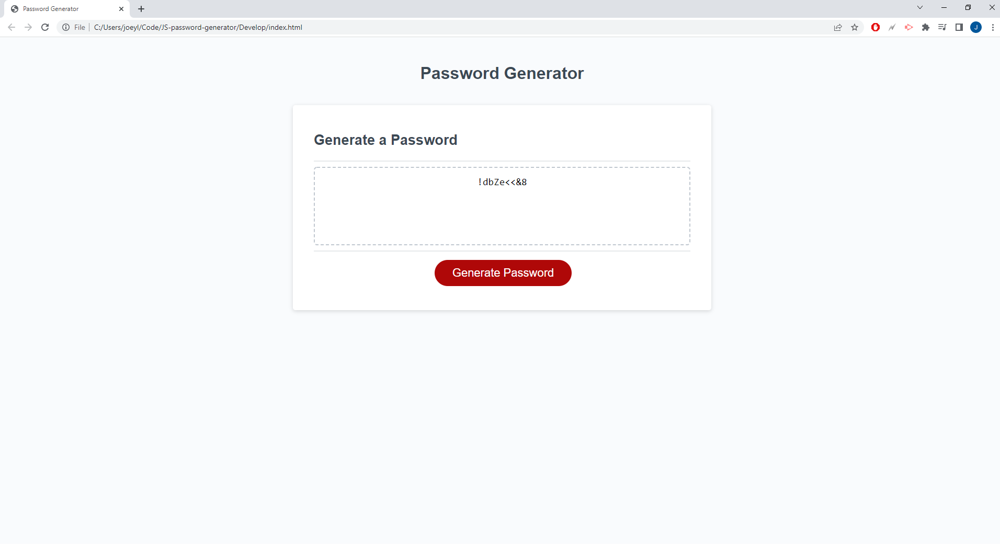

# JS Password Generator

## My Tasks and What I Learned
- Utilizing my knowledge of javascript to create a password generator based around the criteria of user preference.
- Used new found knowledge of loops, alert(), function(), Math.floor, Math.Random.
- The importance of capitalization and having the console open when running my code. I wasted about 30-45 minutes because I did not have the console open and in my code I had math.floor and not Math.floor.
- Sometime it is better to have the variable not be global and just be internal for the function.
- Variables and functions cannot have the same name.

## Screenshot
- 

##
Repository URL: https://github.com/JoeyLiu518/JS-password-generator
Deployed URL: https://joeyliu518.github.io/JS-password-generator/
